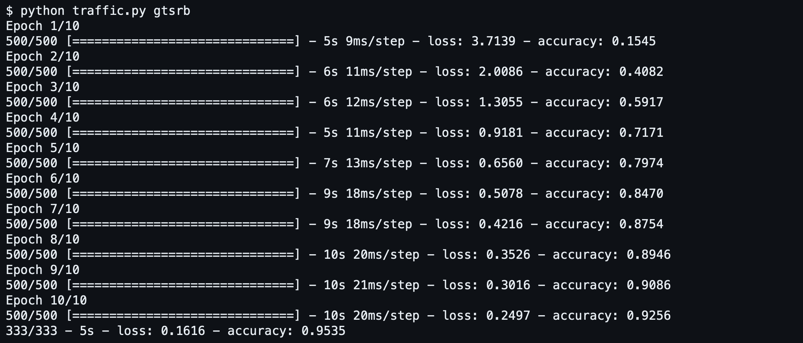

### Project 5 - Neural Networks:

  

### 5 - Traffic

As research continues in the development of self-driving cars, one of the key challenges is computer vision, allowing these cars to develop an understanding of their environment from digital images. In particular, this involves the ability to recognize and distinguish road signs – stop signs, speed limit signs, yield signs, and more.

In this project, you’ll use TensorFlow to build a neural network to classify road signs based on an image of those signs. To do so, you’ll need a labeled dataset: a collection of images that have already been categorized by the road sign represented in them.

Several such data sets exist, but for this project, we’ll use the German Traffic Sign Recognition Benchmark (GTSRB) dataset, which contains thousands of images of 43 different kinds of road signs.

We used 3 convolutional layers to understand the patterns inside each sign image. The image was divided in 2x2 sections. The first layer was used to understand very basic information such as edges by learning 32 patters in each section of the image. The second layer tried to understand shapes such as triangles and circles by learning 64 patterns inside each section. Lastly, the third layer tried to understand parts of the traffic sign itself by learning 128 patters in each section.

A hidden layer with 4x as many categories of traffic signs was used to extract all the information gathered and corretely understand and differenciate this information allowing to corretely identify the category in which a traffic sign belongs to.

The output layer consisted in 10 units each representing one category of traffic signs.

The file outputModel.keras is the saved model with an accuracy of 99%. We can guarantee no overfitting since the delta between training and testing was 1-2%. 