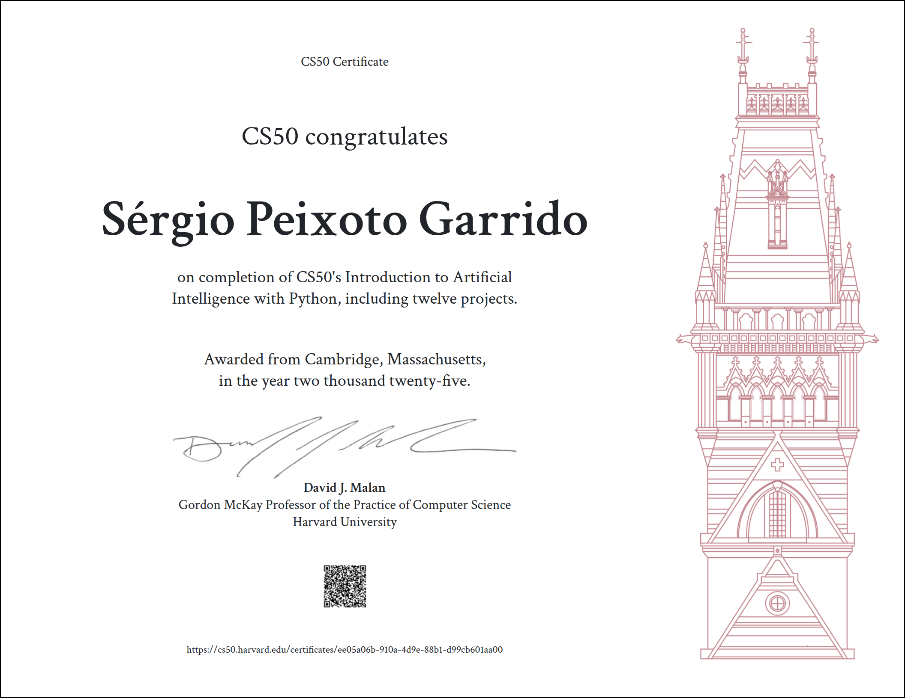

# CS50 - Introduction to Artificial Intelligence with Python

 All projects from CS50's - Introduction to Artificial Intelligence with Python.
 For details on each project and it's implementation check the respective directory.

  

### Project 0 - Search:

  0a - Degrees - Finds the shortest path between any two actors by choosing a sequence of movies that connects them.

  0b - Tic Tac Toe - The classic game where the player faces an opposing AI. 

  

### Project 1 - Knowledge:

 1a - Knights - Through the use of logical rules I wrote an AI capable of deducing the conclusion of certain problems and puzzles.
 
 1b - Minesweeper - The classic game where this time the AI will play for you decide which squares are safe based on known knowledge of the board.

  

### Project 2 - Uncertainty:

2a - PageRank - Write an AI to rank web pages by importance.

2b - Heredity - Write an AI to assess the likelihood that a person will have a particular genetic trait.

  

### Project 3 - Optimization:

3 - Crossword - Write an AI to generate crossword puzzles.

  

### Project 4 - Machine Learning:

4a - Shopping - Write an AI to predict whether online shopping customers will complete a purchase through supervised learning.

4b - Nim -  Write an AI that teaches itself to play Nim through reinforcement learning.

  

### Project 5 - Neural Networks:

5 - Traffic - Write an AI to identify which traffic sign appears in a photograph.

  

### Project 6 - Natural Language

6a - Parser - Write an AI to parse sentences and extract noun phrases.

6b - Attention - Write an AI to predict a masked word in a text sequence.

  

